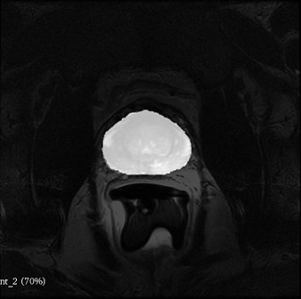

# 3D-Unet: patched based Pytorch implementation for prostate T2w segmentation (weights available)

The training and the inference are patch based: the script randomly extract corresponding patches of the images and labels and feed them to the network during training.
The inference script resample the iamge, extract, segment the sigle patches and automatically recontruct them in the original resolution. 
*******************************************************************************
### Data
The training and testing was performed on the public available dataset of the PROMISE12 challenge (https://promise12.grand-challenge.org/).
*******************************************************************************
### Pre-trained-model
The weights are available and you can download them from the following link: https://drive.google.com/file/d/1-Cz1Xg0Uoku49pIIpnT7TYXztWi_YrBy/view?usp=sharing
*******************************************************************************
### Attention!!!
If you want to segment an image from a 1.5T system + coil, we strongly recommend to apply firt a N4 bias correction filter (https://www.slicer.org/wiki/Documentation/4.10/Modules/N4ITKBiasFieldCorrection)
and windowing the image  before the inference, otherwise the segmentatio will not work. If you do not want to use Slicer there is a snippet code from adjust_mr_contrast.py for the N4 filter. Please modify
it for your test case.

### Example images

Sample MR images from the sagittal view:

*******************************************************************************

### Requirements
pillow
scikit-learn
simpleITK
keras
scikit-image
pandas
pydicom
nibabel
tqdm
torch>=0.4.1
torchvision>=0.2.1
dominate>=2.3.1
visdom>=0.1.8.

### Python scripts and their function

- organize_folder_structure.py: Organize the data in the folder structure for the network

- NiftiDataset.py : They augment the data, extract the patches and feed them to the GAN (reads .nii files). NiftiDataset.py
  skeleton taken from https://github.com/jackyko1991/unet3d-pytorch

- check_loader_patches: Shows example of patches fed to the network during the training  

- UNet.py: the architecture of the U-net.

- utils.py : list of metrics and loss functions for the training

- main.py: Runs the training and the prediction on the training and validation dataset.

- predict.py: It launches the inference on training and validation data in the main.py

- predict_single_image.py: It launches the inference on a single input image chosen by the user.

## Usage
Modify the init.py to set the parameters and start the training/testing on the data:
Folder Structure:

	.
	├── Data_folder                   
	|   ├── train_set              
	|   |   ├── data_1             # Training
	|   |   |   ├── A              # Contains domain A images 
	|   |   |   └── B              # Contains domain B labels 
	|   |   └── data_2             
	|   |   |   ├── A              
	|   |   |   └── B              
	|   ├── test_set               
	|   |   ├── data_1             # Testing
	|   |   |   ├── A              
	|   |   |   └── B              
	|   |   └── data_2             
	|   |   |   ├── A              
	|   |   |   └── B              
	|   ├── validation_set               
	|   |   ├── data_1             # Validation
	|   |   |   ├── A             
	|   |   |   └── B              
	|   |   └── data_2             
	|   |   |   ├── A              
	|   |   |   └── B              

## Features
- 3D data processing ready
- Augmented patching technique, requires less image input for training
- one channel output (multichannel to be developed)
- Generic image reader with SimpleITK support 
- Medical image pre-post processing with SimpleITK filters
- Easy network replacement structure
- Dice score similarity measurement as golden standard in medical image segmentation benchmarking

